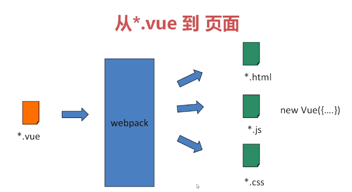
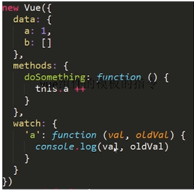
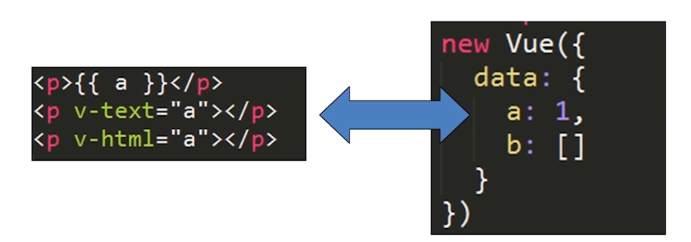
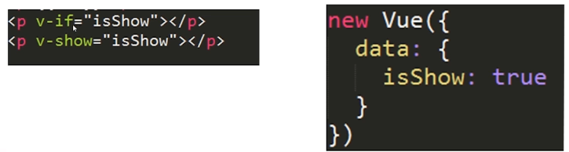
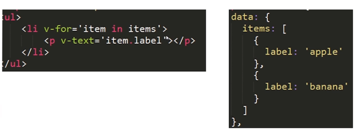
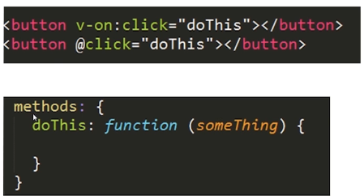
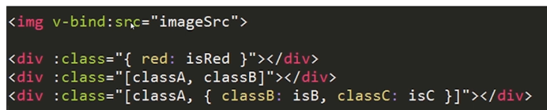
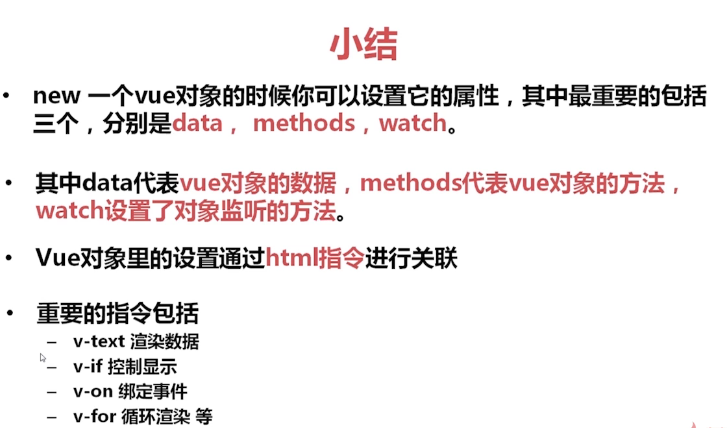
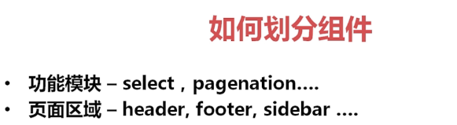
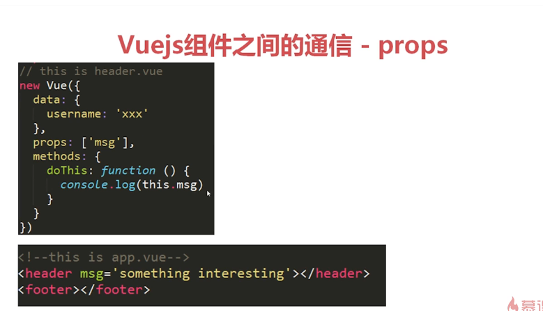

###  简单介绍
vueJS是一种轻量级的MVVM框架，它同时吸收了react和angular的优点，强调了react组件化的概念，可以轻松的实现数据和展现的分离。也吸收了angular灵活的指令和页面操作的一些方法。
实现双向数据绑定，目前主要有三种方式：脏检查、观察机制、封装属性访问器
脏检查：框架将所有需要监控的属性放在一个序列中，当发生特定事件时，遍历整个序列，对被监控的属性做对比，如果发生变化，则调用相应的处理函数。
观察机制：通过 Object.observe() 「已废弃」方法对对象进行监控，一旦其发生变化，将会执行相应的handler。
封装属性访问器：使用 Object.defineProperty 将对象的属性转换为 getter/setter ，当依赖项的 setter 被调用时，会通知 watcher 重新计算，从而致使它关联的组件得以更新。
### vue.js的一个组件
.vue文件其实就是一个vue.js的组件，相当于HTML + javascript + css
### 安装
命令行工具
解决npm国内网络慢的问题。http://npm.taobao.org/  以后使用要用cnpm代替npm就ok
接下来就可以用：$ cnpm install --global vue-cli
# 全局安装 vue-cli
$ cnpm install --global vue-cli
# 创建一个基于 webpack (打包工具)模板的新项目
$ vue init webpack my-project
# 安装依赖，走你
$ cd my-project
$ cnpm install
$ cnpm run dev

### 从.vue到页面

### vue组件的重要选项data、methods、watch
vue所有的数据都是放在data里面的

### 模板指令--html和vue对象额粘合剂
数据渲染v-text、v-html、{{}}

### 模板指令--v-if/v-show

### 模板指令--v-for
渲染循环列表

### 模板指令--v-on
事件绑定

### 模板指令--v-bind
属性绑定

思考上面的变量哪些是字符串哪些是布尔值
### 总结

### 组件
只有注册了组件才能在html上使用
### .vue 开发的组件 怎么加到已有的项目里去？
比如你开发了一个header.vue组件，当你需要应用这个组件时需要import header from "路径/header"，别忘了在引用的文件中注册：components: {header }

### 如何划分组件

### 组件调用

### 组件之间的通信
父组件向子组件传递信息（参数）

子组件向父组件传递信息（参数）
<pre>
    vm.$on('test', function (msg) {
      console.log(msg)
    })
    vm.$emit('test', 'hi')
    // -> "hi"  $emit触发当前实例上的事件。附加参数( hi )都会传给监听器回调。
</pre>

