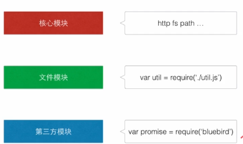
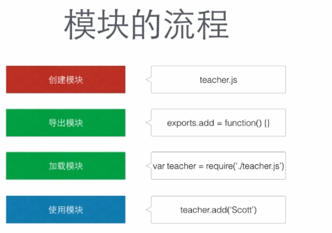

### node.js是什么
javascript 的执行需要特定的运行环境。客户端的js依赖于浏览器来解析，而服务器端的js，就靠nodejs来解析。nodejs 还提供了一系列的工具包，比如： 1.操作电脑上的文件（这是客户端js不具备的）  2. 开服务器 

总结：你用了nodejs开了服务器就不用wamp啦   wamp是集成 php,apache,mysql这些环境的。
后台语言有 php, java 等，这你肯定知道，然鹅，nodejs 的出现，使得js也可以作为后台语言了~

nodejs的使用可以避免变量污染（当引用大量Js文件时，js缺少模块管理机制，可以通过命名空间来解决），nodejs依据Commonjs规范来决定怎么组织javascript），不同于jQuery，Commonjs是一套规范。

### nodejs模块的分类
模块的分类：核心模块，文件模块，第三方模块（模块与文件一一对应）
### 模块的引用
模块的引用，可以通过路径，也可以通过模块名。模块名引用最终也会被映射为路径。包含了核心函数的核心模块，会在node启动时被预先加载。非核心模块是指通过npm加载的第三方模块和本地模块

### 模块的流程

### this
作用域：与调用函数,访问变量的能力有关 作用域分为：局部和全局（在局部作用域里可以访问到全局作用域的变量，但在局部作用域外面就访问不到局部作用里面所设定的变量）
上下文：与this关键字有关 是调用当前可执行代码的引用
this总是指向调用这个的方法的对象

